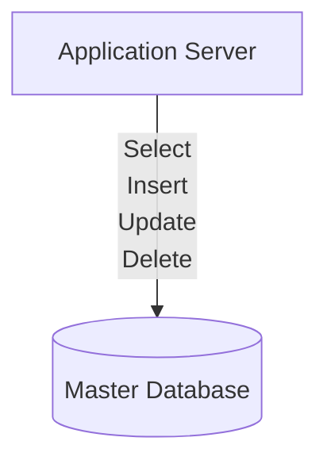
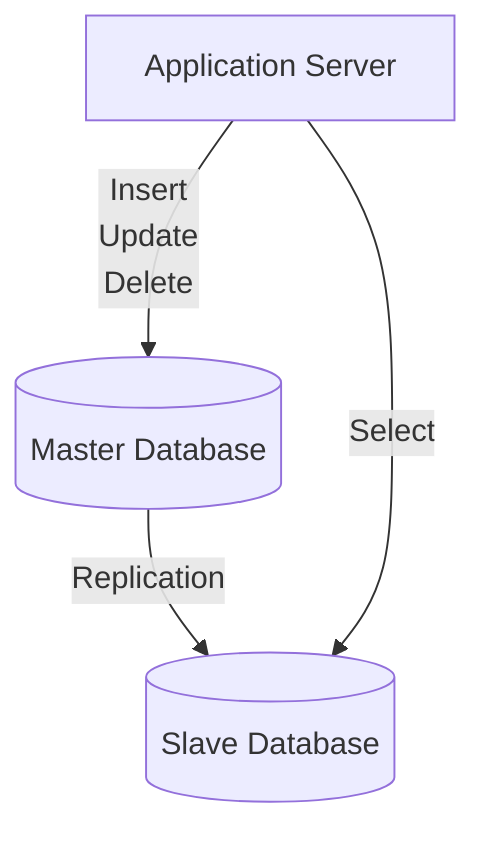
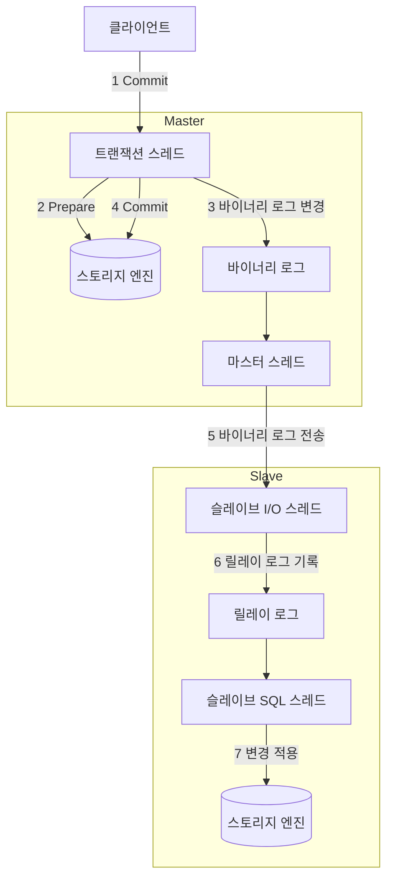

# DB Replication
>[! hint] 두 개 이상의 DBMS 이용하여 Master/Slave(수직적) 구조를 활용해 db의 부하를 분산시키는 기술
## 배경

단순한 database를 구성할 때에는 하나의 서버와 하나의 database를 구성하게 된다
사용자가 많아지면서 Database는 많은 Query를 처리하기 힘든 상황이 되었다
Query의 대부분을 차지하는 Select를 해결하기 위해 Replication 이라는 방법이 나왔다

# Replication 이란?
두 개의 이상의 DBMS 시스템을 Mater / Slave로 나눠서 동일한 데이터를 저장하는 방식

Master DBMS에는 데이터의 수정 사항만 반영하고 Replication을 통해 Slave DBMS에 실제 데이터를 복사

# 데이터 복사
## 로그 기반 복제(Binary Log)
- statement based: SQL 문장을 복사하여 진행
- Row Based : SQL에 따라 변경된 Row 라인만 기록
- Mixed Based : 기본적으로 statement based 로 진행하면서 필요에 따라 row based 사용

# 동작 원리
MYSQL 기준 Replication은 기본적으로 비동기 복제 방식을 사용
Master 노드에서 변공되는 데이터에 대한 이력을 로그에 기록하면 Replicaiton Master Thread 가 비동기적으로 이를 읽어 Slave 쪽으로 전송
## 순서도

1. Commit 발생
2. Connection Thread에서 스토리지 엔진에게 해당 트랜잭션에 대한 Prepare(Commit 준비)를 수행
3. Commit을 수행하기 전에 먼저 Binary Log에 변경사항을 기록
4. 스토리지 엔진에게 트랜잭션 Commit을 수행하도록 한다.
5. Master Thread는 시간에 구애받지 않고 (비동기적으로) Binary Log를 읽어서 Slave로 전송
6. Slave의 I/O Thread는 Master로부터 수신산 변경 데이터를 Relay Log에 기록
7. Slave의 SQL Thread는 Relay Log에 기록된 변경 데이터를 읽어서 Slave의 스토리지 엔진에 적용
# 장점
- Select 성능 향상
	- Query의 대부분을 차지하는 SELECT를 Slave Database를 이용한다면 Read(Select) 성능 향상 효과를 얻을 수 잇음
	- Master Database 영향 없이 로그를 분석 할 수 있음
- 데이터 백업
	- Master의 내용을 복제하기 때문에 database 가 지워진다고 해도 Slave 중 하나를 백업 용도로 사용할 수 있음
# 단점
- 데이터 정합성을 보장할 수 없음
	- Slave는 Master의 복사본을 사용하기 때문에 완벽하다고 할 수 없음
	- 예를 들어 Slave가 Master의 쿼리 처리량을 따라가지 못한다면 데이터 정합성이 보장되지 않음
- Binary Log File 관리
	- Master는 Binary Log가 무분별하게 쌓이는 것을 막기 위해 데이터 보관 주기를 설정하지만, Master는 Slave 까지 관리하지 않기 때문에 Master에서 Binary Log File을 삭제햇다고 Slave의 Binary Log 를 삭제하지 못함
- Fail Over 불가
	- master에서 Error 가 발생했을 경우 Slave File over 하는 기능을 지원하지 않음
	- Slave 역시 Master와 Log 위치가 다르다면 관리자가 작업을 해야함

# 출처
- [출처1](https://nesoy.github.io/blog/Database-Replication)
- [출처2](https://velog.io/@zpswl45/DB-Replication-%EA%B0%9C%EB%85%90-%EC%A0%95%EB%A6%AC)