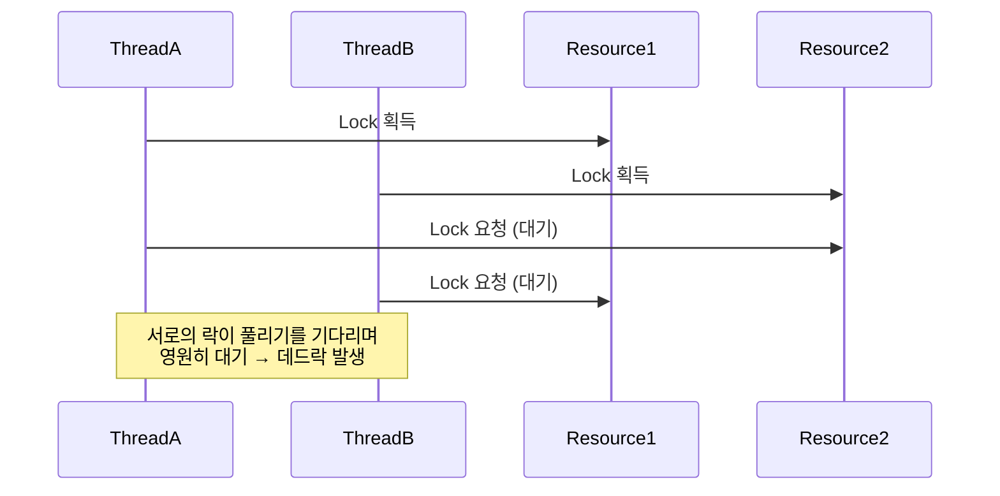

# 정의
두 개 이상의 동시 작업이 서로 완료되기를 기다리는 경우 발생
두 스레드가 다른 스레드의 잠금 해제를 기다리기 때문에 서로 영원히 차단할 때 데드락이 발생

## 데드락 발생 조건
- 최소한 하나의 리소스는 *하나의 스레드만 동시에 엑세스* 할 수 있도록 상호 배타적
- 보류 및 대기 : 쓰레드는 다른 리소스게 오기를 *기다리는 동안 한 리소스는 보류*해야함
- 선점 없음 : 스레드가 리소스를 획득한 후에는 리소스에 대한 잠금을 *강제로 제거할 수 없음*
- 순환 대기 : 각 스레드는 순환 방식으로 다른 스레드에서 리소스를 기다려야 함

## 피하는 법
### Thread.join() 사용
한 스레드가 다른 스레드를 시작하기 전에 완료할 수 없도록 Thread.join() 사용
예시) 한 스레드가 한 파일을 읽고 다른 스레드가 동일한 파일을 읽을 수 없도록 
### 동기화 개체 사용
뮤텍스, 세마포어 같은 동기화 개체를 사용하는 것
동일한 리소스에 대한 잠금을 위해 경쟁하는 여러 스레드로 인해 발생하는 교착 상태로부터 보호
java 에서 교착 상태를 방지하려면 동기화된 블록이 고정된 순서로 사용되는지 항상 확인되어야 함
### 중첩 잠금 방지
객체에 대한 잠금이 이미 확득되었을때 다른 잠금을 획득하지 않음
또한 잠금 획득을 위한 제한 시간 정책을 구현하고 여러 스레드에서 동일한 순서로 리소스에 액세스
### 필요하지 않을 때 잠금을 사용하지 않는다
잠금은 절대적으로 필요한 경우에만 획득해야 하고 가능한 빨리 해제해야한다
### 적절한 코드 설계
스레드 간에 순환 대기 종속성이 없도록 프로그램을 설계해야한다.