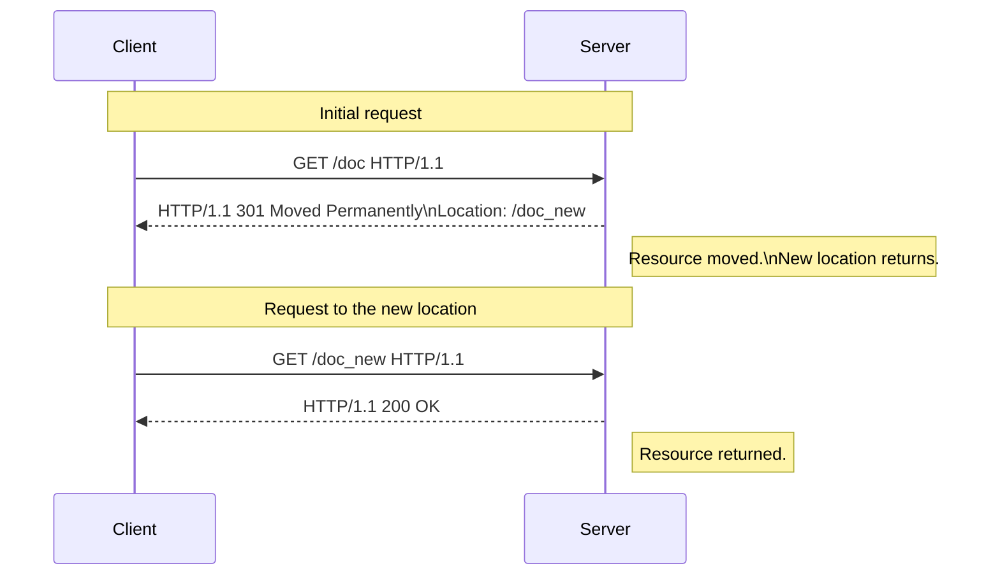

# 리다이렉트
사용자가 처음 요청한 URL이 아닌, 다른 URL로 보내는 것을 뜻함

[[http 상태코드#3XX 리다이렉트]] 응답에서 일어난다

## 과정

1. 클라이언트에서 서버로 최초 요청을 보냅니다.
2. 최초 요청을 받은 웹서버는 HTTP 응답 상태코드로 3XX를 보내고 응답 메시지 헤더 중 Location 값으로 리다이렉트 되어야 할 주소를 설정해 리턴합니다.
3. 브라우저등의 웹 클라이언트는 HTTP 응답 메시지의 상태코드가 3XX라는 것을 보고 리다이렉트라는 것을 인지하여 Location에 설정되어 있는 URL로 다시 재요청합니다